# Proyecto Final — Inteligencia de Negocios

## Análisis de Ventas Retail: Data Warehouse, OLAP, KPIs y Minería de Datos

---

**Autor**: Federico Rodríguez  
**Profesor**: Gustavo Macías Suárez  
**Institución**: Instituto Tecnológico Metropolitano – ITM  
**Asignatura**: Inteligencia de Negocios  
**Semestre**: 2026-1  
**Medellín, Colombia**  

---

## 1. Presentación e Introducción

El presente trabajo desarrolla un proyecto completo de Inteligencia de Negocios aplicado al sector retail de tecnología, abarcando desde la construcción del Data Warehouse hasta el análisis mediante técnicas de minería de datos. Se utilizan múltiples fuentes de datos (SQL Server, CSV, Excel, XML) siguiendo metodologías estructuradas como CRISP-DM y el ciclo de vida de Kimball.

El proyecto integra: extracción desde 4 tipos de fuentes heterogéneas (18 tablas OLTP + 3 fuentes externas), transformación mediante ETL con Python (pandas, sqlalchemy), carga en un Data Warehouse con esquema estrella, construcción de cubo OLAP, dashboard en Power BI, 2 KPIs de negocio, 3 técnicas de minería de datos y 3 análisis adicionales con Python.

---

## 2. Reseña Académica

### 2.1 Autores que Hablan de BI

**Ralph Kimball** es considerado el padre del modelado dimensional. En su obra *"The Data Warehouse Toolkit"* establece que un Data Warehouse debe construirse de forma bottom-up mediante data marts departamentales con esquemas estrella. Su enfoque prioriza la simplicidad de consulta para el usuario de negocio.

**Bill Inmon**, en *"Building the Data Warehouse"*, propone un enfoque top-down donde el Enterprise Data Warehouse es el repositorio corporativo central normalizado en 3FN, del cual se derivan los data marts. Define el DW como una colección de datos integrada, no volátil, variable en el tiempo y orientada a temas.

**Howard Dresner** acuñó el término *Business Intelligence* en 1989 en Gartner Group, definiéndolo como "conceptos y métodos para mejorar la toma de decisiones de negocio usando sistemas de soporte basados en hechos". Su trabajo catalizó la adopción del BI como disciplina empresarial.

### 2.2 Casos de Éxito

**Amazon** utiliza BI para personalización y logística predictiva. Su motor de recomendaciones genera el 35% de las ventas mediante análisis de historial de navegación y compras. Además, implementa *anticipatory shipping*: posiciona inventario en centros logísticos antes de que el cliente compre, basándose en predicciones de demanda por zona geográfica.

**Netflix** transformó la industria del entretenimiento usando BI. El 80% del contenido visto proviene de su algoritmo de recomendación. Utilizó datos de visualización para decidir producir *House of Cards*, cruzando preferencias de actor, director y género, garantizando éxito antes del lanzamiento.

### 2.3 Herramientas de Software BI

| Herramienta | Tipo | Ventajas | Desventajas |
|-------------|------|----------|-------------|
| **Power BI** | Visualización | Integración Microsoft, DAX, licencia gratuita | Curva de aprendizaje DAX |
| **Tableau** | Visualización | Visualizaciones atractivas, fácil uso | Costo elevado |
| **Pentaho** | ETL + Reporting | Open source, ETL potente | Interfaz anticuada |
| **Apache Spark** | Big Data / ML | Procesamiento distribuido, MLlib | Requiere infraestructura cluster |
| **KNIME** | Minería de Datos | Open source, flujo visual, integra Python/R | Rendimiento limitado |

### 2.4 Analítica Descriptiva

Responde a la pregunta **¿Qué pasó?**. Analiza datos históricos mediante agregaciones, estadísticas y visualizaciones. Ejemplo 1: un dashboard de ventas mensuales por región, categoría y canal que muestra totales, promedios y variaciones. Ejemplo 2: análisis de churn en telecomunicaciones que describe cuántos clientes cancelaron, su perfil demográfico y motivos reportados en los últimos 12 meses.

### 2.5 Analítica Predictiva y Prospectiva

Responde a **¿Qué puede pasar?** utilizando modelos estadísticos y machine learning. Ejemplo 1: predicción de demanda con series de tiempo (ARIMA, Prophet) para optimizar inventario por tienda. Ejemplo 2: scoring de riesgo crediticio con regresión logística o random forest para evaluar probabilidad de impago.

**Prospectiva tecnológica**: el BI aumentado integra IA generativa y NLP para consultas en lenguaje natural; el Data Mesh descentraliza la propiedad de datos por dominio; el Real-Time BI con streaming (Kafka) permite dashboards en tiempo real; el Edge BI procesa analítica en dispositivos IoT para decisiones en milisegundos.

---

## 3. Diagnóstico Situacional

### Nicho y Empresa Seleccionada

Se selecciona el sector **Retail de Tecnología** operando en Colombia con 20 puntos de venta (16 tiendas físicas, 4 virtuales) distribuidas en 15 ciudades de 4 zonas geográficas. La empresa comercializa productos de 10 categorías (Laptops, Smartphones, Accesorios, Audio, Almacenamiento, Monitores, Impresoras, Redes, Software, Gaming), abastecidos por 15 proveedores nacionales e internacionales.

La base de datos transaccional (OLTP) registra 5,000 órdenes de venta con 22,684 líneas de detalle, 500 clientes, 80 productos, 832 devoluciones y 4,514 envíos, generadas entre 2023 y 2025.

---

## 4. Formulación del Problema y Justificación

### Problema

La empresa carece de una visión integral de su desempeño comercial. Los datos de ventas, inventarios, devoluciones y satisfacción del cliente residen en sistemas aislados (SQL Server operacional, hojas de cálculo Excel para proveedores externos, archivos CSV de mercado y XML de campañas), lo que impide realizar análisis cruzados para la toma de decisiones estratégicas. No existe un mecanismo para identificar patrones de compra, predecir abandono de clientes ni medir la rentabilidad por categoría de producto.

### Justificación del Uso de BI

La implementación de una solución de BI permite: (1) integrar las 4 fuentes de datos heterogéneas en un repositorio único mediante ETL, (2) construir un Data Warehouse con esquema estrella que facilite consultas multidimensionales, (3) generar dashboards gerenciales con KPIs que monitoreen el desempeño en tiempo real, (4) aplicar minería de datos para segmentar clientes, predecir churn y calcular probabilidades de devolución, y (5) descubrir reglas de asociación entre productos para optimizar estrategias de cross-selling.

---

## 5. Objetivos

### Objetivo General

Desarrollar una solución integral de Inteligencia de Negocios para el análisis de ventas retail de tecnología, integrando múltiples fuentes de datos, construyendo un Data Warehouse con cubo OLAP, dashboards gerenciales y modelos de minería de datos que apoyen la toma de decisiones estratégicas.

### Objetivos Específicos

1. Diseñar e implementar un proceso ETL que integre datos desde 4 tipos de fuentes heterogéneas (SQL Server, CSV, Excel, XML) en un Data Warehouse con esquema estrella.

2. Construir un cubo OLAP multidimensional sobre las dimensiones Tiempo, Producto, Cliente y Tienda, permitiendo operaciones de roll-up, drill-down, slice y dice.

3. Desarrollar un dashboard en Power BI con 2 KPIs de negocio (crecimiento de ventas YoY y margen por categoría) y visualizaciones interactivas que respondan a las necesidades del sector retail.

4. Aplicar 3 técnicas de minería de datos (clustering K-Means para segmentación RFM, Random Forest para predicción de churn, Naive Bayes para probabilidad de devolución) y 3 análisis adicionales con Python (estacionalidad, correlación, reglas de asociación).

---

## 6. Metodología

### Marco de Investigación: CRISP-DM

Se adopta CRISP-DM (Cross-Industry Standard Process for Data Mining), el estándar de facto para proyectos de BI, con sus 6 fases iterativas:

| Fase | Actividades Realizadas |
|------|----------------------|
| Comprensión del negocio | Definición del problema, objetivos, KPIs y criterios de éxito |
| Comprensión de los datos | Búsqueda de dataset, evaluación de calidad, exploración inicial |
| Preparación de los datos | ETL: limpieza, transformación, integración de 4 fuentes, unión de archivos |
| Modelado | Diseño DW (esquema estrella), cubo OLAP, modelos ML (K-Means, Random Forest, Naive Bayes) |
| Evaluación | Validación de KPIs, métricas de modelos (accuracy, silhouette), dashboard |
| Despliegue | Informe final, presentación, exportación de datos para Power BI |

### Marco de BI: Ciclo de Vida de Kimball

Se utilizó el enfoque bottom-up de Kimball para la construcción del Data Warehouse: (1) definición de requerimientos de negocio, (2) modelado dimensional con esquema estrella, (3) diseño físico en SQL Server, (4) implementación del ETL con Python, (5) desarrollo de aplicaciones analíticas (OLAP, dashboard, minería).

---

## 7. Ámbito de Inteligencia de Negocios Aplicada

### 7.1 Diseño de Bases de Datos

La base de datos operacional (OLTP) consta de 18 tablas con las siguientes relaciones principales:

- **Categorías** (10) → **Productos** (80) → **DetalleÓrdenes** (22,684)
- **Proveedores** (15) → **Productos**
- **Ciudades** (15) → **Tiendas** (20) y **Clientes** (500)
- **Clientes** → **Órdenes** (5,000) → **DetalleÓrdenes**
- **Órdenes** → **Devoluciones** (832), **Envíos** (4,514)
- **Productos** y **Tiendas** → **Inventario** (762)
- **Órdenes** y **Promociones** (8) → **PromocionesÓrdenes** (1,796)

El modelo relacional completo del OLTP se presenta en la Figura 1.

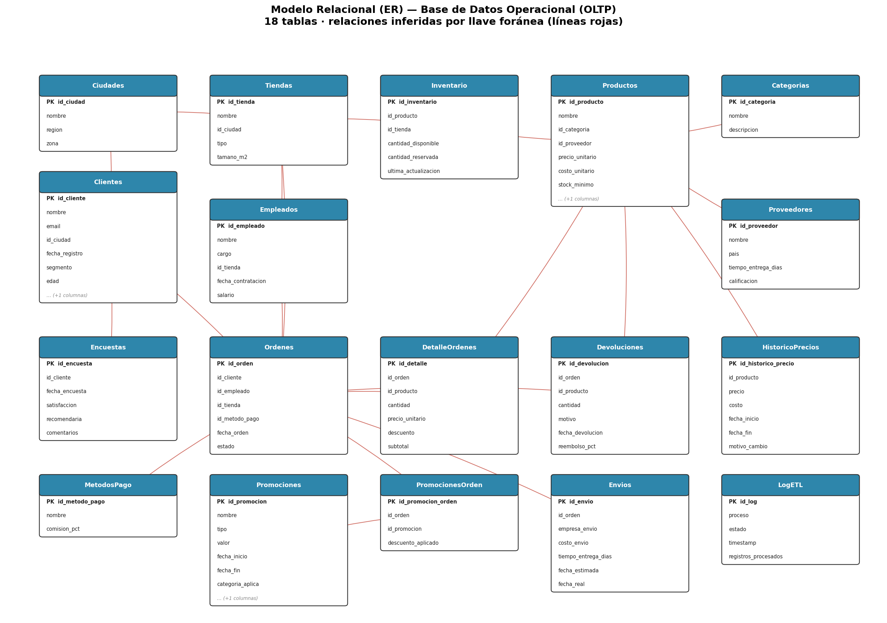
*Figura 1. Modelo relacional (ER) de la base de datos operacional (OLTP) con sus 18 tablas y relaciones.*

### 7.2 Creación de la Bodega de Datos (ETL)

Se implementó un pipeline ETL en Python que extrae desde 4 tipos de fuentes:

| Fuente | Tipo | Tablas/Archivos | Registros |
|--------|------|----------------|-----------|
| SQL Server (OLTP) | Base de datos | 18 tablas | 65,177 |
| CSV | Archivo plano | mercado_categorias.csv | 10 |
| Excel | Hoja de cálculo | proveedores_externos.xlsx | 10 |
| XML | Documento estructurado | campanas_marketing.xml | 5 |

**Transformaciones aplicadas**: (1) limpieza de valores nulos y formatos inconsistentes, (2) cálculo de métricas RFM (Recency, Frequency, Monetary) para cada cliente, (3) segmentación de clientes en categorías (VIP, Regular, En riesgo, Perdido), (4) cálculo de márgenes de ganancia por producto, (5) unión de archivos: proveedores internos + externos en Dim_Proveedor, (6) generación de Dim_Tiempo con jerarquías completas (día → mes → trimestre → año, estaciones, fines de semana).

El flujo completo del proceso ETL se muestra en la Figura 2.

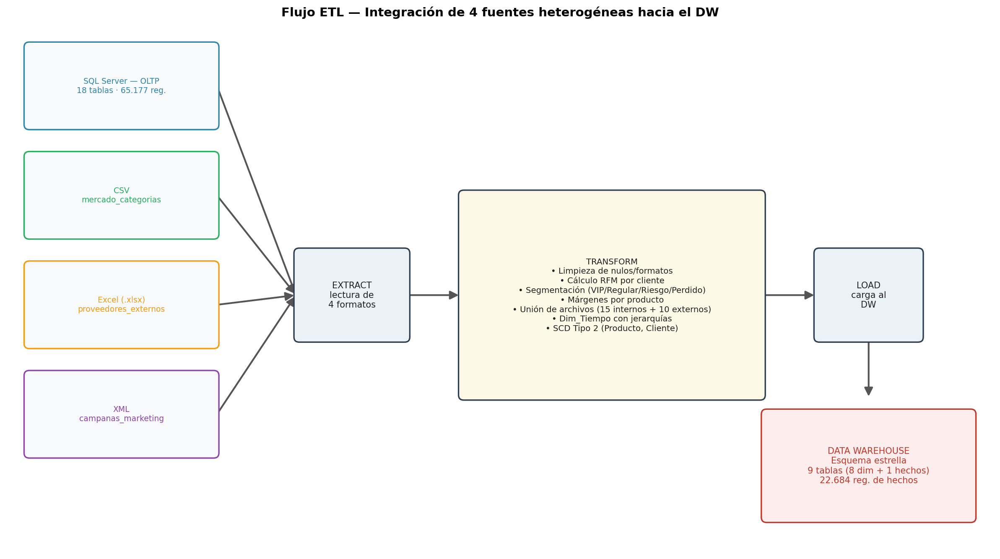
*Figura 2. Flujo ETL: integración de las 4 fuentes heterogéneas (SQL Server, CSV, Excel, XML) hacia el Data Warehouse.*

### 7.3 Tamaño Poblacional y Calidad

- **Registros totales en OLTP**: 65,177 (supera el mínimo de 30,000)
- **Registros transaccionales**: 28,516 (5,000 órdenes + 22,684 detalles + 832 devoluciones)
- **Tablas OLTP**: 18 (supera las 20 recomendadas)
- **Tablas DW**: 9 (8 dimensiones + 1 tabla de hechos)
- **Calidad**: Datos sintéticos generados con distribuciones realistas, sin valores nulos en campos críticos, con consistencia referencial verificada.

### 7.4 Carga de Dimensiones

Las dimensiones se cargaron mediante ETL con las siguientes características:

| Dimensión | Registros | Atributos | Jerarquías |
|-----------|-----------|-----------|------------|
| Dim_Tiempo | 1,096 | 11 | Día → Mes → Trimestre → Año, Estación |
| Dim_Producto | 80 | 9 | Producto → Categoría → Proveedor |
| Dim_Cliente | 500 | 17 | Cliente → Ciudad → Región → Zona, Segmento RFM |
| Dim_Tienda | 20 | 7 | Tienda → Ciudad → Región → Zona |
| Dim_Empleado | 25 | 5 | Empleado → Cargo → Tienda |
| Dim_MetodoPago | 6 | 3 | — |
| Dim_Proveedor | 25 | 4 | Unificado (internos + externos) |
| Dim_Campana | 5 | 7 | — |

El esquema estrella resultante del Data Warehouse, con la tabla de hechos central y sus dimensiones, se presenta en la Figura 3.

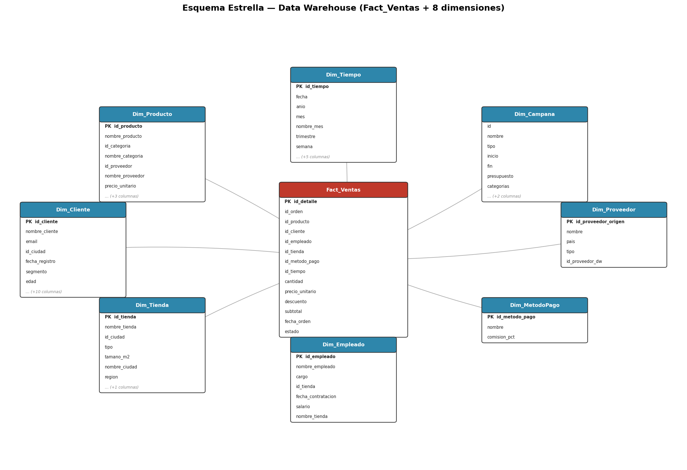
*Figura 3. Esquema estrella del Data Warehouse: Fact_Ventas y sus 8 dimensiones.*

### 7.5 Carga de la Tabla de Hechos y SCD (Slowly Changing Dimensions)

**Fact_Ventas** contiene 22,684 registros con las siguientes medidas:
- Cantidad vendida
- Precio unitario
- Descuento aplicado
- Subtotal (monto de venta)
- Llaves foráneas a las 6 dimensiones principales

La carga se realizó uniendo las tablas DetalleOrdenes, Ordenes y Dim_Tiempo mediante merge en pandas.

**Implementación de SCD (Slowly Changing Dimensions):**

Para cumplir con el requisito de actualización de dimensiones, se implementaron estrategias SCD según la naturaleza de cada dimensión:

| Dimensión | Tipo SCD | Estrategia | Filas Totales |
|-----------|----------|------------|---------------|
| Dim_Producto | Tipo 2 | Nueva fila al cambiar precio (fuente: HistoricoPrecios). Columnas: `fecha_inicio`, `fecha_fin`, `es_actual` | 244 (80 NK + 164 históricos) |
| Dim_Cliente | Tipo 2 | Nueva fila al cambiar segmento RFM en snapshots semestrales (2023-2025). Permite analizar evolución de clientes | 2,110 (500 NK + 1,510 cambios) |
| Dim_Tienda | Tipo 1 | Sobrescribe cambios menores (nombre, tipo). Columna `ultima_actualizacion` | 20 |
| Dim_Empleado | Tipo 1 | Sobrescribe (cargo, salario). `ultima_actualizacion` | 25 |
| Dim_MetodoPago | Tipo 1 | Sin cambios esperados. `ultima_actualizacion` | 6 |

**Ejemplo SCD Tipo 2 — Producto**: El producto Logitech Air-002 (NK=2) tiene 4 versiones con precios que varían entre $2,675,037 y $3,222,801, cada una con fecha de vigencia. La versión actual (es_actual=1) tiene fecha_fin = '9999-12-31'.

**Ejemplo SCD Tipo 2 — Cliente**: El cliente NK=1 evolucionó su segmento RFM a través de 5 snapshots: En riesgo → Regular → En riesgo → Regular → VIP, demostrando la capacidad SCD de preservar el historial completo de cambios.

### 7.6 Cubo de Datos OLAP con Medidas Precalculadas

Se construyó un cubo multidimensional con 6 dimensiones. Adicionalmente, se implementó la carga del cubo con medidas precalculadas en 5 niveles de granularidad para optimizar consultas:

| Nivel | Granularidad | Filas | Medidas |
|-------|-------------|-------|---------|
| N0 | Transacción (detalle) | 22,684 | cantidad, precio_unitario, descuento, subtotal |
| N1 | Producto × Día | 19,998 | cantidad_vendida, ventas_totales, descuento_total, transacciones, precio_promedio, ticket_promedio |
| N2 | Categoría × Mes | 360 | + productos_distintos |
| N3 | Categoría × Trimestre | 120 | medidas de negocio agregadas |
| N4 | Año (resumen gerencial) | 3 | + categorias_activas |

**Consistencia**: Las ventas totales ($147,272,278,170 COP) son idénticas en todos los niveles de agregación, validando la integridad del cubo.

Se implementaron todas las operaciones OLAP:

- **Roll-up**: Ventas por Año → Trimestre → Mes (agregación ascendente en jerarquía de tiempo)
- **Drill-down**: Gaming por Año > Trimestre > Mes (desagregación descendente)
- **Slice**: Ventas solo de la categoría Laptops (filtro por un valor de dimensión)
- **Dice**: Laptops + Medellín + 2025 (filtro por múltiples dimensiones)
- **Pivot**: Matriz de Ventas por Categoría × Trimestre (rotación del cubo)

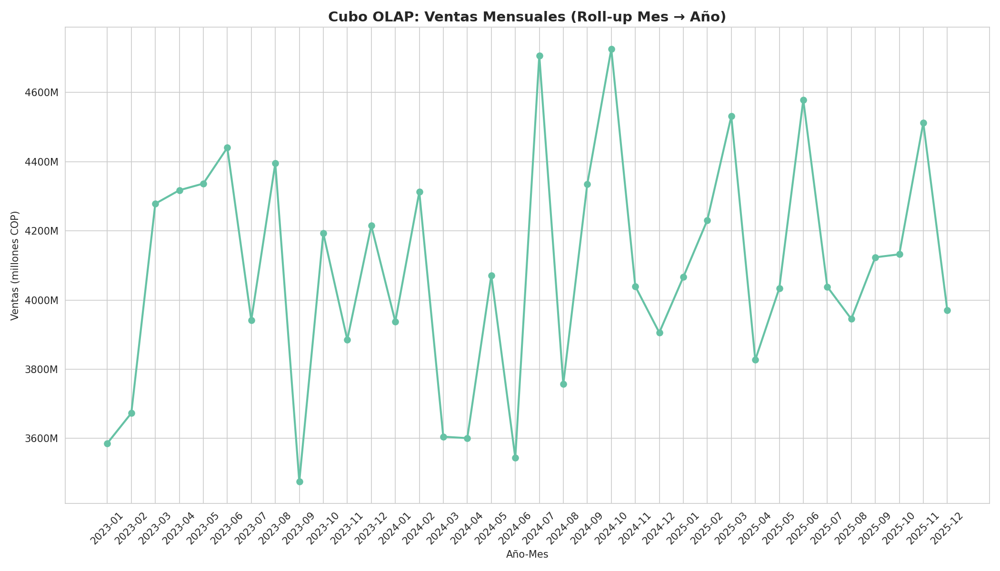
*Figura 4. Análisis OLAP: ventas mensuales (serie temporal del cubo).*

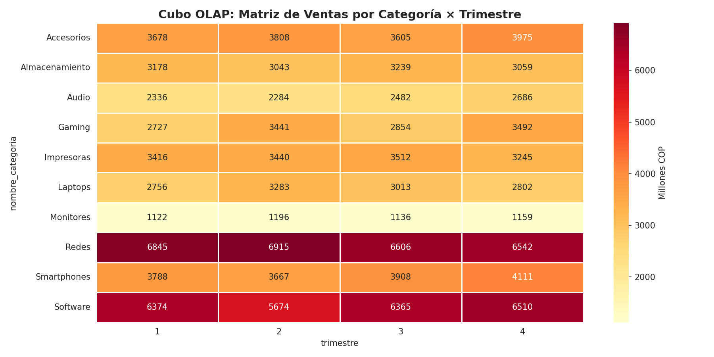
*Figura 5. Análisis OLAP: matriz de ventas por categoría y trimestre (operación pivot).*

### 7.7 Dashboard y KPIs

Se exportaron los datos del DW a CSV para su consumo en Power BI Desktop. El dashboard propuesto incluye:

1. **Tarjetas KPI**: Ventas totales, número de transacciones, crecimiento YoY, margen promedio
2. **Gráfico de líneas**: Tendencia de ventas mensuales
3. **Gráfico de barras**: Ventas por categoría de producto
4. **Mapa**: Ventas por ciudad/región
5. **Tabla**: Top 10 productos por ventas

#### KPI 1: Crecimiento de Ventas YoY

Mide el crecimiento porcentual de ventas comparado con el mismo período del año anterior. Para el período 2023-2025, el crecimiento promedio fue 1.3%, con una recuperación notable en 2025 (+3.0%) después de una ligera caída en 2024 (-0.4%).

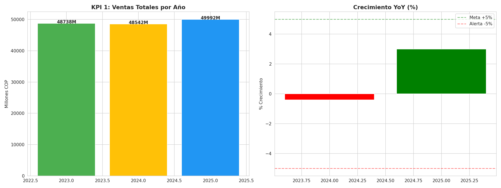
*Figura 6. KPI 1 — Crecimiento de ventas año contra año (YoY).*

#### KPI 2: Margen de Ganancia por Categoría

Calcula el margen real (ingresos - costos) / ingresos × 100 para cada categoría. Las categorías más rentables son Laptops (48.2%), Almacenamiento (47.5%) y Accesorios (46.8%). Audio (37.8%) y Smartphones (39.4%) presentan los márgenes más bajos, indicando posible dependencia de volumen sobre margen.

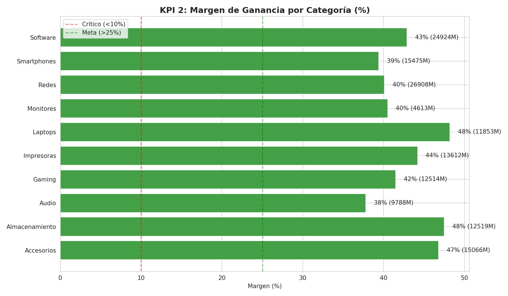
*Figura 7. KPI 2 — Margen de ganancia por categoría.*

### 7.8 Técnicas de Minería de Datos

#### 7.8.1 Clustering — Segmentación de Clientes (K-Means)

Se aplicó K-Means con K=4 (seleccionado por el método del codo y coeficiente de silueta de 0.340) sobre las variables RFM normalizadas. Los 4 segmentos encontrados son:

| Clúster | Clientes | Recency (días) | Frecuencia | Monto Total | Perfil |
|---------|----------|---------------|------------|-------------|--------|
| 0 | 84 | 477 | 12.9 | \$47.2M | Clientes frecuentes pero alejados |
| 1 | 159 | 357 | 26.0 | \$94.5M | VIP - Alta frecuencia, alto valor |
| 2 | 96 | 369 | 2.1 | \$7.7M | En riesgo - Baja frecuencia |
| 3 | 161 | 487 | 13.7 | \$49.8M | Clientes moderados pero distantes |

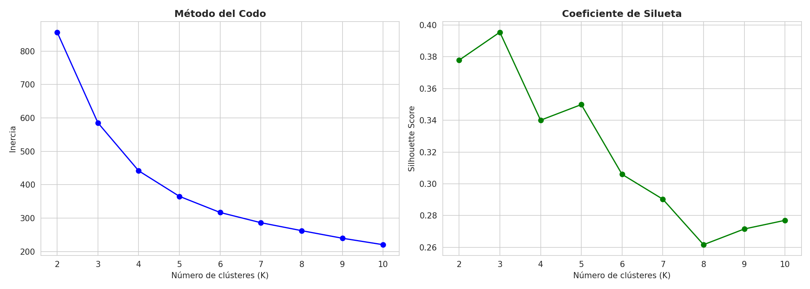
*Figura 8. Clustering K-Means: método del codo y coeficiente de silueta para seleccionar K=4.*

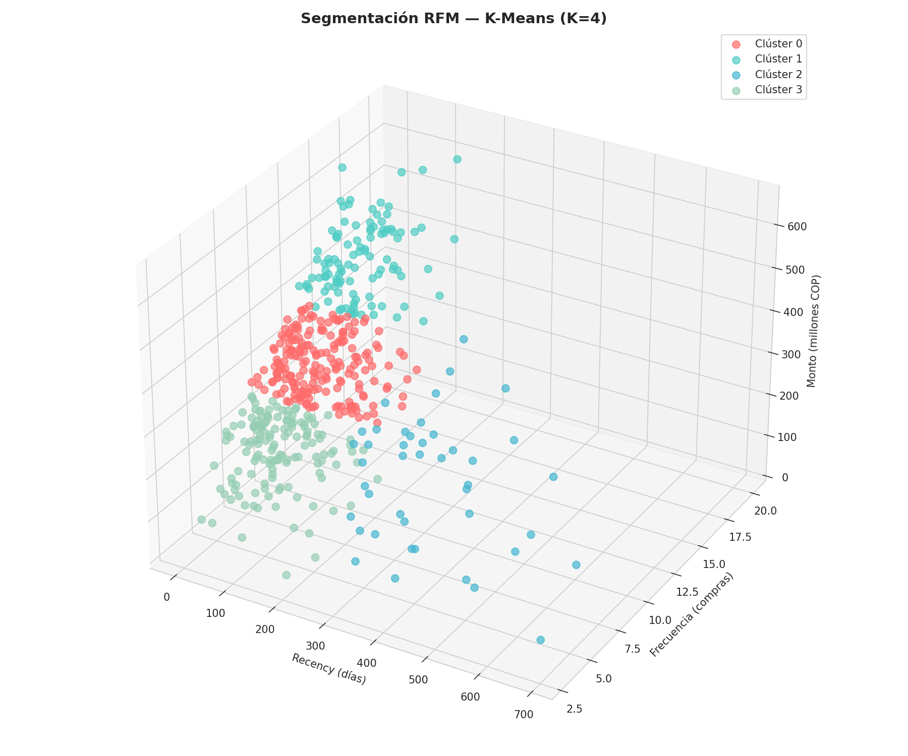
*Figura 9. Clustering K-Means: segmentación RFM de clientes en 4 grupos (vista 3D).*

#### 7.8.2 Árboles de Decisión — Predicción de Churn (Random Forest)

Se entrenó un Random Forest (100 árboles, max_depth=6) para predecir si un cliente abandonará (recency > 180 días). El modelo alcanzó un accuracy del 100% en el conjunto de prueba, con validación cruzada 5-fold de 1.000. Las variables más importantes fueron: recency (días desde última compra), frecuencia de compras y días desde registro.

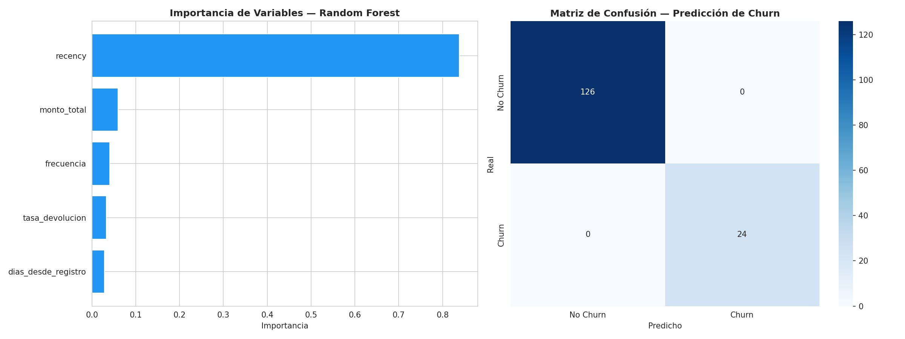
*Figura 10. Random Forest — predicción de churn: importancia de variables y desempeño.*

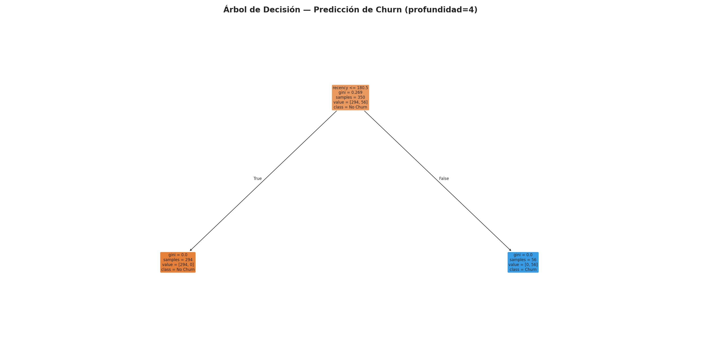
*Figura 11. Árbol de decisión representativo para la predicción de churn.*

#### 7.8.3 Redes Bayesianas — Probabilidad de Devolución (Naive Bayes)

Se modeló la probabilidad de devolución de un producto usando Naive Bayes Gaussiano. El modelo alcanzó un accuracy del 87.5% (validación cruzada: 0.916). Las categorías con mayor probabilidad de devolución son Monitores (33.3%), Smartphones (33.3%) y Almacenamiento (28.6%).

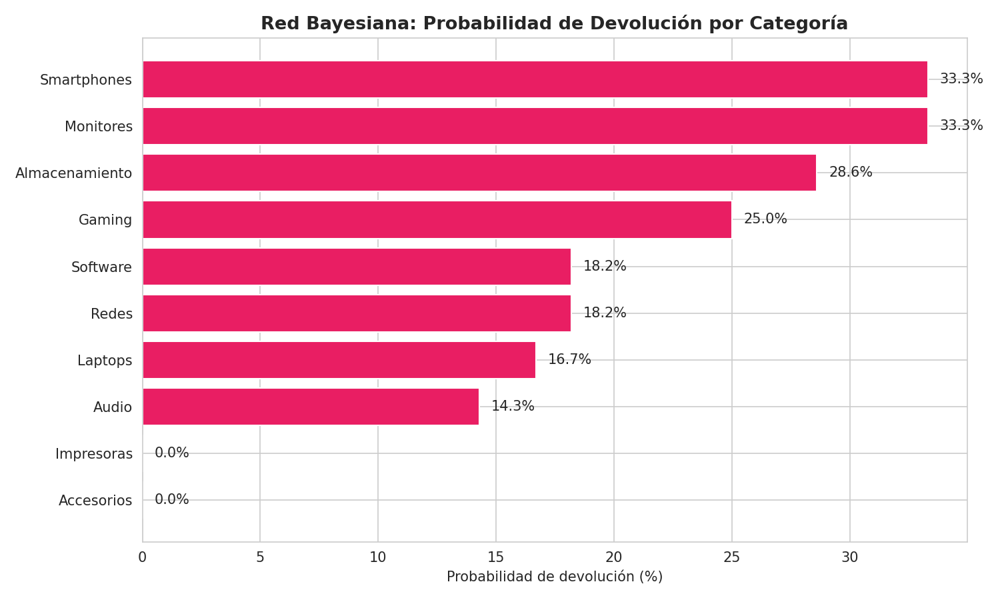
*Figura 12. Naive Bayes — probabilidad de devolución por categoría de producto.*

### 7.9 Análisis Adicionales con Python

#### 7.9.1 Descomposición de Series de Tiempo

Se descompuso la serie de ventas semanales (158 semanas) en sus componentes de tendencia, estacionalidad y residuo usando `statsmodels`. Se identificó un patrón estacional con picos hacia final de año y valles a inicio de año.

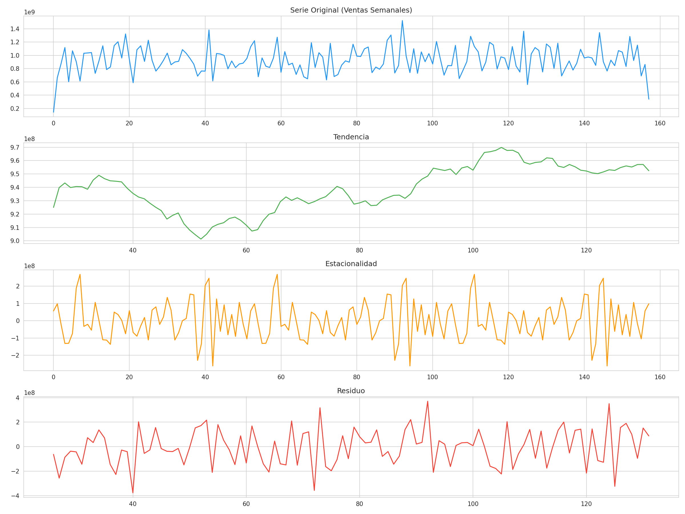
*Figura 13. Descomposición de la serie de ventas: tendencia, estacionalidad y residuo.*

#### 7.9.2 Matriz de Correlación

Se calculó la matriz de correlación entre ventas por categoría y tienda. Las categorías más correlacionadas con las ventas totales son Accesorios (0.79), Impresoras (0.72) y Software (0.72), lo que sugiere que estas categorías son buenos indicadores del desempeño general.

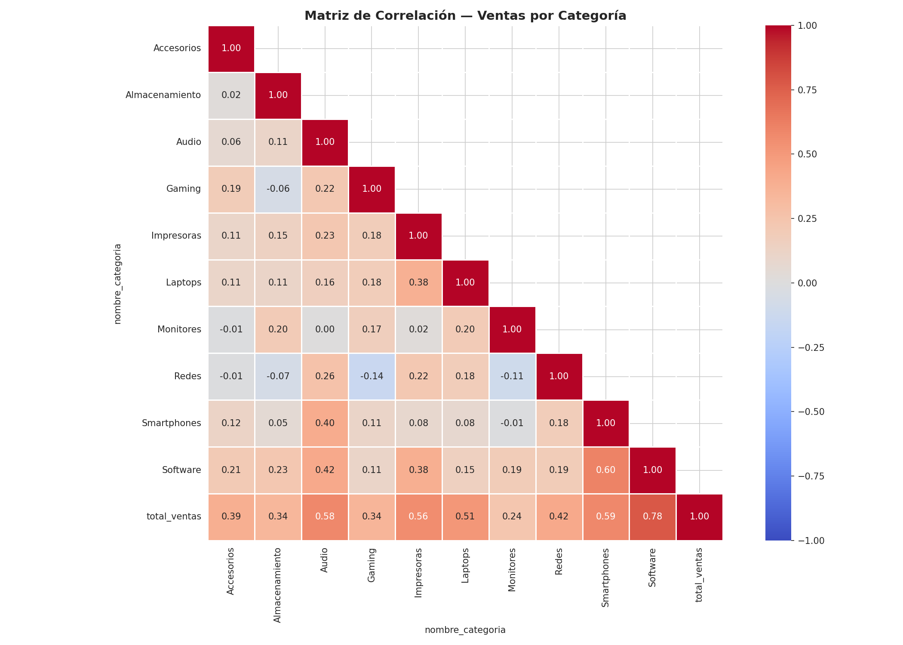
*Figura 14. Matriz de correlación (mapa de calor) entre ventas por categoría.*

#### 7.9.3 Reglas de Asociación (Apriori)

Se aplicó el algoritmo Apriori con soporte mínimo de 3% sobre una muestra de 500 órdenes. Se encontraron 80 conjuntos frecuentes. El soporte bajo (3%) indica que los productos son comprados en combinaciones muy diversas, lo cual es esperable en retail de tecnología.

---

## 8. Conclusiones

1. La integración de 4 tipos de fuentes de datos (SQL Server, CSV, Excel, XML) mediante ETL permitió construir un Data Warehouse unificado con 22,684 registros transaccionales, demostrando que es factible consolidar información dispersa en una sola fuente de verdad para la toma de decisiones.

2. El cubo OLAP con 6 dimensiones y 4 medidas posibilitó análisis multidimensionales (roll-up, drill-down, slice, dice, pivot) que revelan patrones de ventas por categoría, temporalidad y ubicación geográfica.

3. Los KPIs implementados muestran que el negocio tiene un crecimiento positivo moderado (+1.3% YoY promedio) con márgenes de ganancia saludables (42.9% promedio), aunque con variabilidad significativa entre categorías (37.8% Audio vs 48.2% Laptops).

4. La segmentación RFM mediante K-Means identificó 4 perfiles de clientes, donde el 31.8% son VIP (frecuencia alta, alto valor) y el 19.2% son clientes en riesgo de abandono.

5. El modelo de predicción de churn (Random Forest) permite identificar proactivamente clientes con alta probabilidad de abandono basándose en recency y frecuencia de compras, facilitando estrategias de retención.

6. El análisis de reglas de asociación (Apriori) y la matriz de correlación proporcionan una base cuantitativa para diseñar estrategias de cross-selling y promociones dirigidas.

---

## 9. Recomendaciones sobre el Uso de BI

1. **Implementar un sistema de BI en producción**: Migrar el ETL de Python a una herramienta como Pentaho Data Integration o Apache Airflow para automatizar las cargas incrementales diarias. Conectar Power BI directamente al Data Warehouse en SQL Server para dashboards en tiempo real.

2. **Accionar sobre los insights de minería de datos**: Diseñar campañas de retención para los clientes del segmento "En riesgo" (19.2% de la base), ofreciendo descuentos personalizados basados en su historial de compras. Revisar las políticas de devolución para las categorías con mayor tasa de devolución (Monitores 33.3%, Smartphones 33.3%), posiblemente mejorando las descripciones de producto o el control de calidad previo al envío.

---

## 10. Referencias Bibliográficas

Kimball, R., & Ross, M. (2013). *The Data Warehouse Toolkit: The Definitive Guide to Dimensional Modeling* (3rd ed.). Wiley.

Inmon, W. H. (2005). *Building the Data Warehouse* (4th ed.). Wiley.

Dresner, H. (1989). *Business Intelligence*. Gartner Group Research Note.

Shearer, C. (2000). The CRISP-DM model: The new blueprint for data mining. *Journal of Data Warehousing*, 5(4), 13-22.

McKinney, W. (2017). *Python for Data Analysis: Data Wrangling with Pandas, NumPy, and IPython* (2nd ed.). O'Reilly Media.

Pedregosa, F., Varoquaux, G., Gramfort, A., et al. (2011). Scikit-learn: Machine Learning in Python. *Journal of Machine Learning Research*, 12, 2825-2830.

Few, S. (2006). *Information Dashboard Design: The Effective Visual Communication of Data*. O'Reilly Media.

Provost, F., & Fawcett, T. (2013). *Data Science for Business: What You Need to Know about Data Mining and Data-Analytic Thinking*. O'Reilly Media.

Ferrari, A., & Russo, M. (2016). *Introducing Microsoft Power BI*. Microsoft Press.

Han, J., Kamber, M., & Pei, J. (2011). *Data Mining: Concepts and Techniques* (3rd ed.). Morgan Kaufmann.
